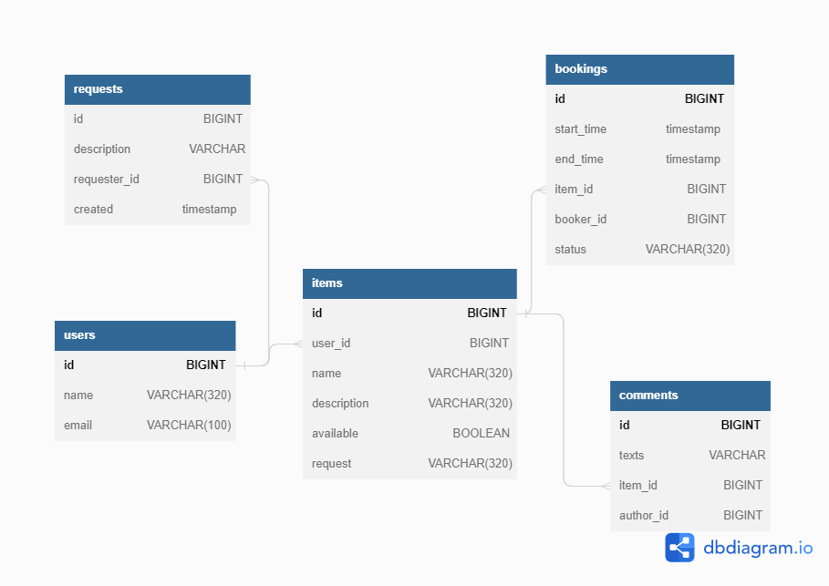

# shareit

## Таблица BOOKINGS:

1. id - PRIMARY KEY AUTO INCREMENT
2. start_time
3. end_time
4. item_id - FOREIGN KEY (ITEMS)
5. booker_id
6. status 

## Таблица USERS:

1. id - PRIMARY KEY AUTO INCREMENT
2. name
3. email

## Таблица ITEMS:

1. id - PRIMARY KEY AUTO INCREMENT
2. user_id - FOREIGN KEY (USERS)
3. name
4. description
5. available
6. request

## Таблица COMMENTS:

1. id - PRIMARY KEY AUTO INCREMENT
2. texts
3. item_id - FOREIGN KEY (ITEMS)
4. author_id
5. created

## Таблица REQUESTS:

1. id - PRIMARY KEY AUTO INCREMENT
2. description
3. requester_id - FOREIGN KEY (USERS)
4. created
